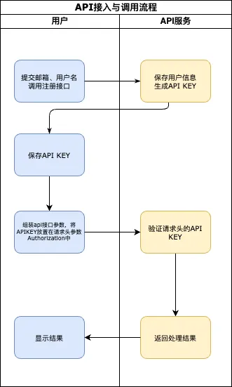
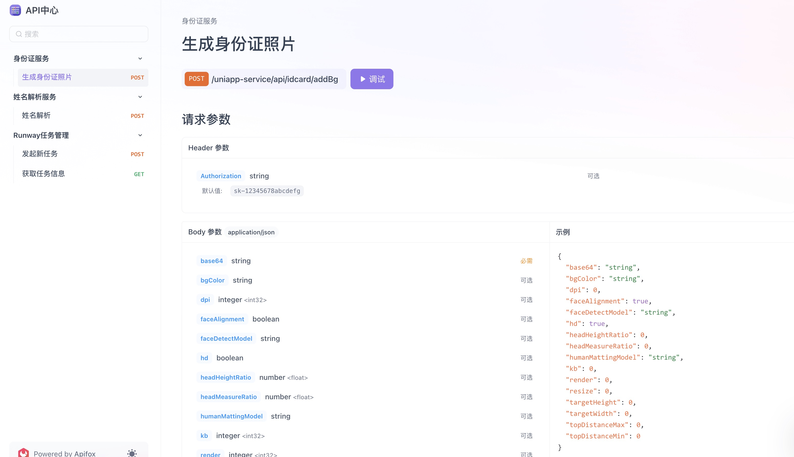

琦木信息科技公司提供了一系列API服务，帮助企业快速集成和扩展功能。以下是接入流程和主要的API服务介绍：

### 接入流程

### 服务介绍

#### 1. 用户注册

用户注册API允许用户创建账户，并自动生成API密钥（API Key），用于后续的API调用。

##### 核心功能
- **用户注册**：创建新的用户账户。
- **生成API Key**：为每个用户生成唯一的API密钥。

#### 2. 身份证服务

身份证服务API用于生成身份证照片，支持自定义背景颜色、分辨率等参数。

##### 核心功能
- **生成身份证照片**：根据输入参数生成高质量的身份证照片。

#### 3. 姓名解析

姓名解析API用于解析中文姓名，提供详细的姓名分析结果。

##### 核心功能
- **姓名解析**：分析姓氏、名字及其相关属性。

#### 4. Runway任务管理

Runway任务管理API用于发起新任务并获取任务信息，支持多种任务类型和参数配置。

##### 核心功能
- **发起新任务**：创建新的Runway任务。
- **获取任务信息**：查询任务的状态和结果。

### API文档截图

以下是API文档的截图，展示了各个API的详细信息：

通过这些API服务，琦木信息科技公司致力于为企业提供高效、可靠的解决方案，助力数字化转型。如果想了解API接口细节请访问[API文档](/apidocs)页面。