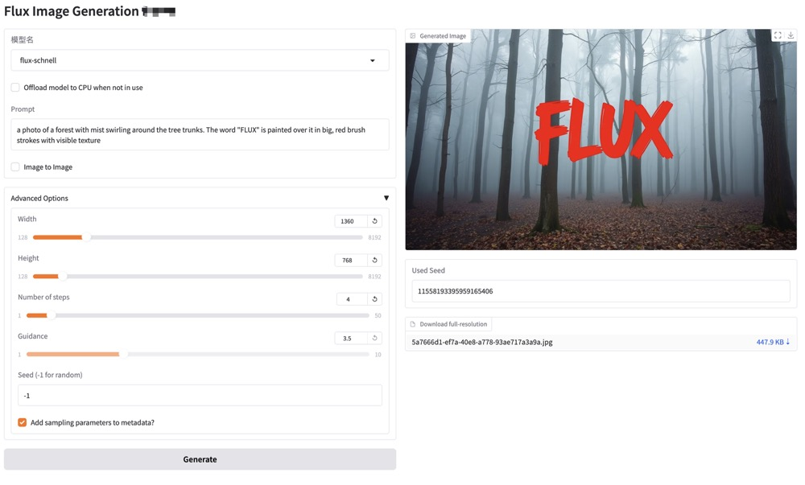
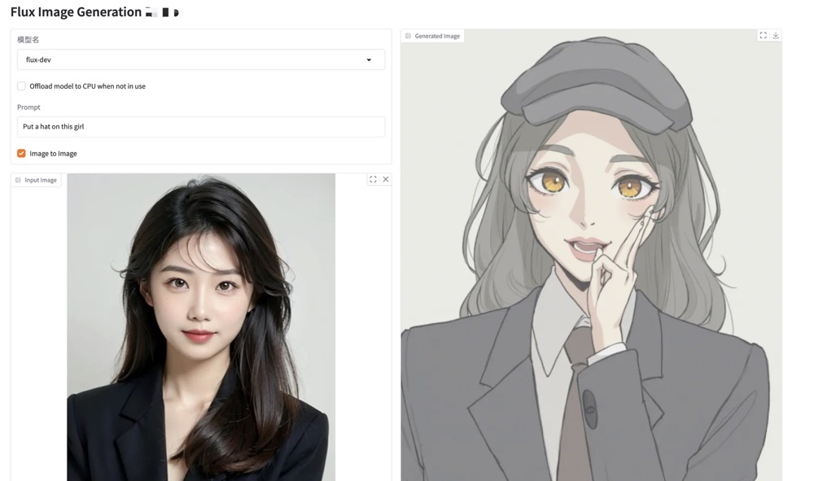
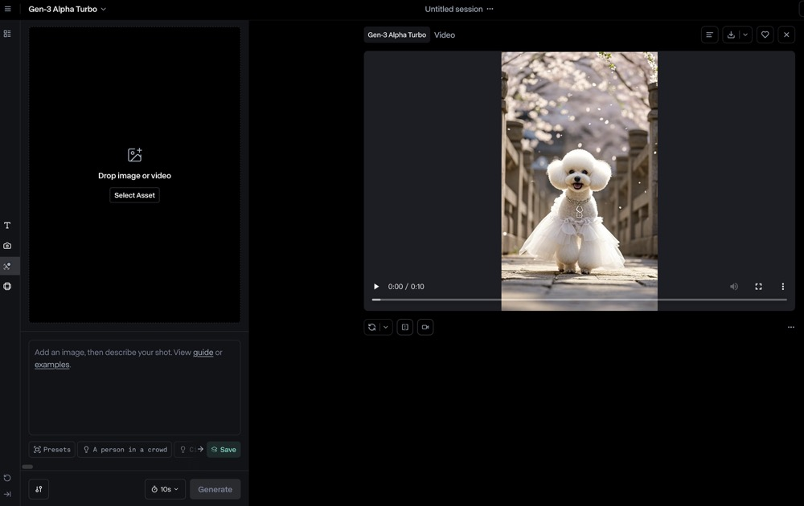
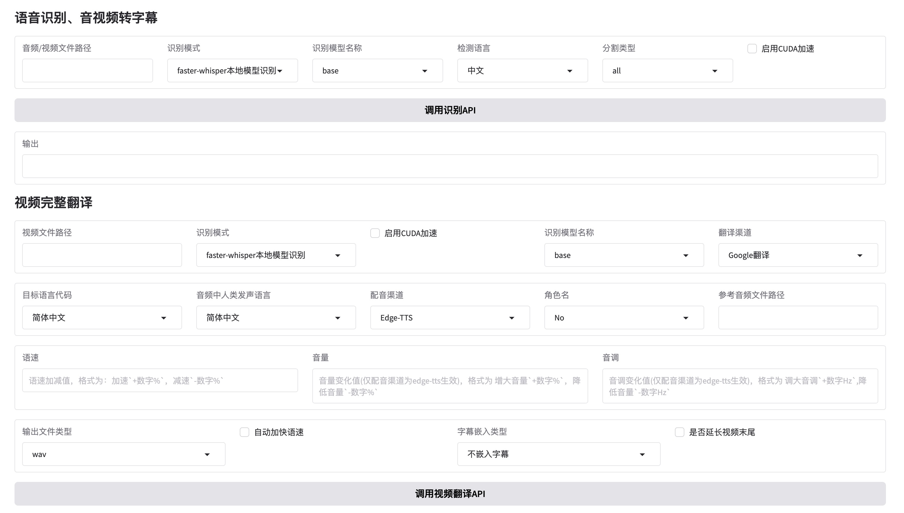
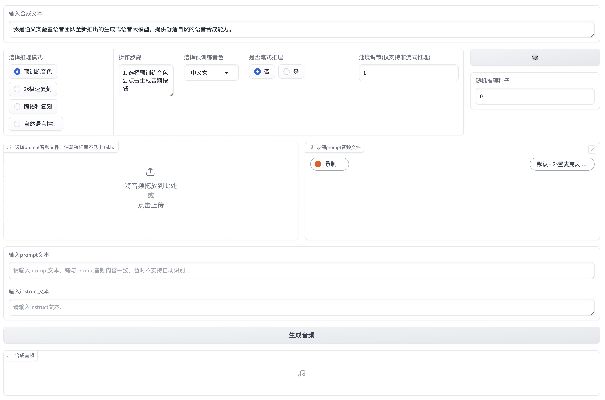
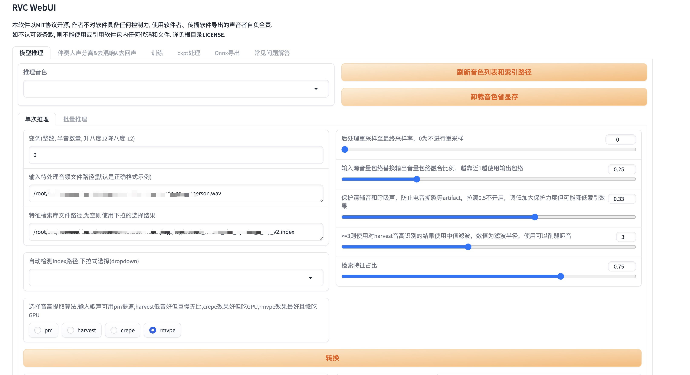
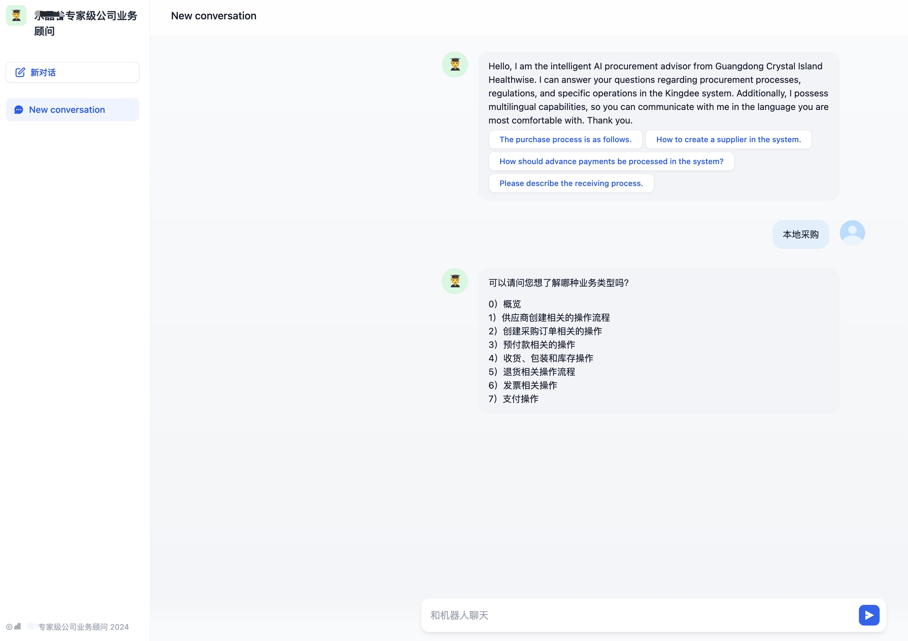
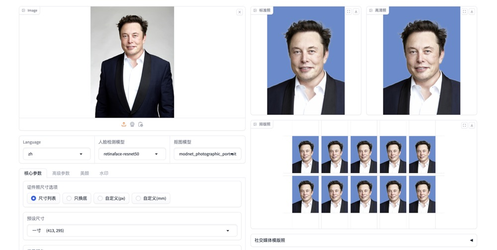

公司专注于开发多种类型的 AI 应用，致力于为客户提供创新的解决方案。以下是我们可以开发的主要 AI 应用类型：

## 1. 类似 ChatGPT 的 AI 应用

我们可以开发基于自然语言处理的对话系统，提供智能问答、客户支持和个性化推荐等功能。

## 2. RAG 类型的应用

RAG（Retrieval-Augmented Generation）应用结合了信息检索和生成模型，能够提供更准确和上下文相关的回答。

## 3. 文生图应用

文生图应用可以根据文本描述生成相应的图像，适用于广告、艺术创作等领域。

## 4. 图生图应用

图生图应用可以根据输入的图像生成新的图像，适用于图像编辑和风格转换等场景。

## 5. 图生视频

图生视频应用可以根据图像生成动态视频，适用于广告和娱乐行业。

## 6. 视频翻译

我们可以开发视频翻译应用，自动将视频中的语音翻译成多种语言，适用于国际化内容。

## 7. Agent 应用

Agent 应用可以执行特定任务，如信息检索、数据分析等，提供智能化的服务。

## 8. 声音克隆

声音克隆技术可以生成与特定人声相似的音频，适用于语音合成和娱乐行业。

## 9. TTS（文本转语音）

TTS 应用可以将文本转换为自然流畅的语音，适用于语音助手和无障碍服务。

## 10. AI 歌手

我们可以开发 AI 歌手应用，生成原创音乐和歌词，适用于音乐创作和娱乐行业。

## 案例展示

### 案例 1: 某公司业务顾问系统

某公司业务顾问系统是基于 RAG（Retrieval-Augmented Generation）技术开发的智能咨询平台，旨在为用户提供高效、准确的业务咨询服务。该系统结合了信息检索和生成模型，能够根据用户的查询提供上下文相关的回答，极大地提升了用户体验。

## 系统特点

- **智能问答**：系统能够理解用户的自然语言查询，并提供准确的答案。
- **上下文理解**：通过 RAG 技术，系统能够根据用户的历史查询和上下文信息，提供更为精准的回答。
- **多领域支持**：系统支持多个业务领域的咨询，能够满足不同用户的需求。
- **多语言支持**：系统支持多种语言，能够满足不同用户的需求。

## 使用场景

- **客户支持**：为客户提供实时的咨询服务，解答常见问题。
- **业务分析**：帮助企业分析市场趋势和业务数据，提供决策支持。
- **知识管理**：整合企业内部知识，提升信息检索效率。

## 系统界面截图

以下是某公司业务顾问系统的界面截图，展示了用户与系统的交互过程：

某公司业务顾问系统通过 RAG 技术的应用，极大地提升了业务咨询的效率和准确性。我们致力于为客户提供高质量的智能咨询服务，帮助他们在复杂的商业环境中做出更明智的决策。如果您对我们的系统感兴趣，欢迎与我们联系以获取更多信息。

### 案例 2: 身份证制作

为自己的小程序提供AI功能之一。

### 案例 3: 生成Runway视频

此功能可以通过图片+Runway提示词的模式来生成视频，用户可通过API服务来免费调用。详细的API文档请参考：[API文档](/apidocs/operations/addusingpost_4)

