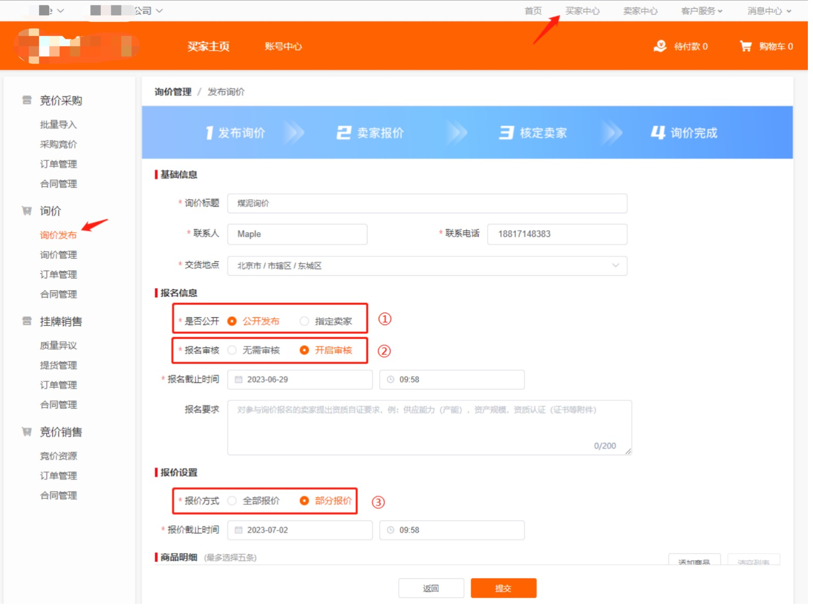
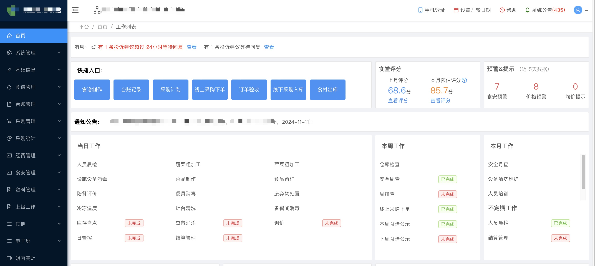

import { Aside } from '@astrojs/starlight/components';

## SaaS软件开发

琦木信息科技公司在SaaS（Software as a Service）软件开发方面拥有丰富的经验和深厚的技术实力。我们致力于为企业提供高效、可靠且易于扩展的SaaS解决方案，助力企业在数字化转型中取得成功。

### 核心优势

- **定制化开发**：根据客户的具体需求，提供量身定制的SaaS解决方案。
- **敏捷开发流程**：采用敏捷开发方法，快速响应客户需求变化，缩短开发周期。
- **安全性保障**：严格遵循安全标准和最佳实践，确保数据安全和隐私保护。
- **可扩展性**：设计灵活的架构，支持业务的持续增长和扩展。
- **用户体验优先**：注重用户界面和用户体验设计，提供直观易用的产品。

### 技术栈

- **前端技术**：React, Vue.js
- **后端技术**：Java,Spring Boot,Spring Cloud,Python
- **数据库**：MySQL, PostgreSQL, MongoDB,ES,Redis
- **云服务**：AWS, 阿里云,腾讯云,华为云
- **DevOps工具**：Docker, Kubernetes, Jenkins,Git,Istio,Helm

### 案例

- **案例一**：为某企业开发了一套完整的商城系统，显著提高了企业的销售业绩和客户满意度。

- **案例二**：为一家初创公司打造了一个高效的CMS管理平台，帮助其实现业务快速增长。

<Aside>其他还有很多不太方便展示的Saas系统。</Aside>

通过专业的技术和优质的服务，琦木信息科技公司致力于成为您最值得信赖的SaaS软件开发伙伴。如果您有任何需求或疑问，请随时联系我们。
